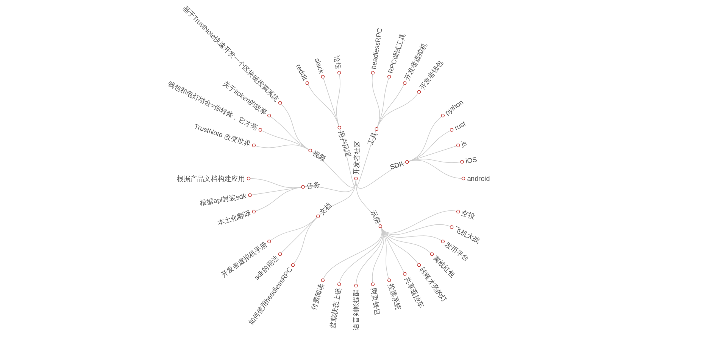

# TrustNote 开发文档（中文）

## 介绍 

> TrustNote 是一个DAG公链，交易速度快，交易费用低。

## 开发

### 源码级开发工具 headlessRPC

headlessRPC是一个轻节点的提供RPC服务的无界面钱包。该钱包具备钱包的一切功能，可以远程调用，但不建议远程调用。建议开发者在本地调用，如果架设在服务器上，RPC端口建议不对外开放。

headlessRPC默认端口为633

### sdk

* python

  用于服务器、PC及物联网设备
  
* js

  用于钱包，开发者构建H5页面，通过jssdk调用钱包，完成转载、查询等功能。
  
* rust

  用于x86架构的PC及开发板(x86架构的物联网主板)。

